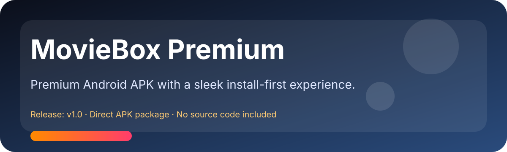
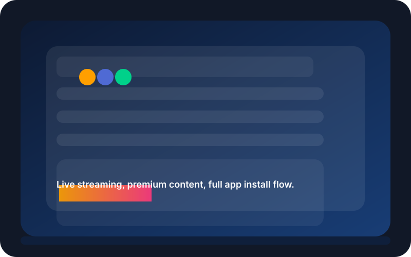

# 🎬 MovieBox Premium

<p align="center">
  
</p>

<p align="center">
  
</p>

> MovieBox Premium is a polished Android APK release with premium streaming and download features.

---

## ✨ Overview

MovieBox Premium offers a premium Android experience with fast downloads, curated content sections, and a polished user interface. This repository holds the `MovieBox Premium v2.apk` release asset only.

## 📦 Included Asset

- `MovieBox Premium v2.apk` — premium MovieBox Android installation package.

## 🎨 Visual Preview

<p align="center">
  
</p>

## 🔥 Main Features

- Premium UI with a clean dark mode design
- Download manager with episode batch download support
- Family mode and study mode controls
- Supports high-quality streaming and offline viewing
- Direct APK release package for quick install

## 🔒 Important Notes

- This repository includes only the APK file and does not contain source code.
- Install only if you trust the source and understand the security implications of third-party APKs.
- Android may require `Install unknown apps` permission for side-loaded packages.

## 🚀 Installation Guide

1. Copy `MovieBox Premium v2.apk` to your Android device.
2. Open the APK using a file browser or APK installer.
3. Allow installation from unknown sources if prompted.
4. Complete the install flow and launch the app.

## 🛠 Repository Status

- This folder is tracked in Git and syncs with `origin/master`.
- To initialize a similar release repository:

  ```bash
  git init
  git add README.md "MovieBox Premium v2.apk"
  git commit -m "Add MovieBox Premium APK release"
  ```

- Add a `.gitignore` for temporary or local files as needed.

## 📌 Disclaimer

This repository is provided as-is. The author is not responsible for issues from installing or using the APK.
